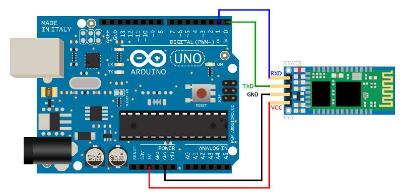
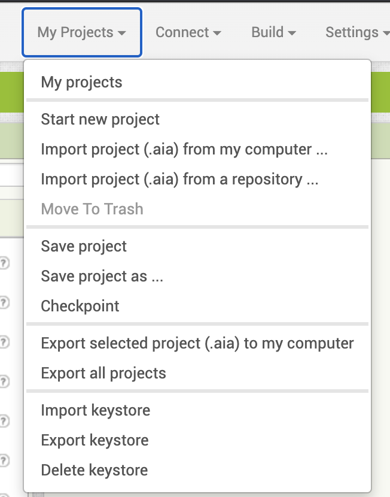

# Smart Home

In these times, smart homes are getting arise. Some materials are available to buy, not too much high price. But using arduino and bluetooth(This can be a espwroom-32 wifi), I make a basic smart home. In this project, After you connect your arduino with phone; if you want to control door, when you enter the password, door can open and closed by phone. In the phone, you can control RGB led. If the gas sensor triggered and after passing the threashold, you can see in the phone, there will be "There is a gas leak at home!". Only way to close the sensor, you have to go inside home and check, what is triggered the sensor. The buzzer is going active while gas sensor triggered. Also If wrong door card is readed, the door will be close and buzzer will triggered. In the outside lambs will close if the sun is coming in to the home.


## Getting Started

First, make sure the bluetooth connected to your arduino. Connect bluetooth to your arduino like below;



### Prerequisites

In the arduino file, make sure you connect your pins correct. 
In the System I used;
```
1 x Bluetooth
1 x Buzzer (For alarm)
1 x RGB led (For changable inside light)
1 x MQ-2 Gas Sensor
1 x Rfid Module (For authentication)
2 x Empty card (True and false card)
1 x Servo motor (For open and close the door)
2 x Temprature Sensor (Inside, outside)
1 x LDR (For automaticly open and close lambs via coming value)
```

To change settings to phone application, in app inventor you have to import .aia file. To do this;



In 'My Projects' you have to click 'Import project(.aia) from my computer...' than import ".aia" file.

### Circuit Video
[](http://www.youtube.com/watch?v=ME7YP17dJ90 "Smart Home Circuit")

### Smart Home Video
[](http://www.youtube.com/watch?v=WSZNuxo6CYQ "Smart Home")

## License

This project is licensed under the MIT License - see the [LICENSE.md](LICENSE.md) file for details
